US Energy Consumption Data Cleaning,Visualisation and Analysis
================

## Data description

We consider data from the US Energy Information Administration’s online
data browser.The data was downloaded from Table 2.2 of the US Energy
Information Administration’s online data browser
(<https://www.eia.gov/totalenergy/data/browser/>). The data set contains
multiple time series, detailing:

-   Primary US residential energy consumption patterns per energy source
    (Fossil Fuels and Renewable Energy) from 1949 until 2021.
-   Electricity Retail Sales
-   Electrical System Energy Losses

The aim of this study is to analyse the monthly residential energy
consumption in the US, since January 2000.We will consider two cases:

-   one of the time series in the dataset.
-   multiple time series in the dataset.

The data includes 7,896 observations for each month of each year since
1949 with 6 columns as it can be seen in the table below.

<table>
<thead>
<tr>
<th style="text-align:center;">
MSN
</th>
<th style="text-align:center;">
YYYYMM
</th>
<th style="text-align:center;">
Value
</th>
<th style="text-align:center;">
Column_Order
</th>
<th style="text-align:center;">
Description
</th>
<th style="text-align:center;">
Unit
</th>
</tr>
</thead>
<tbody>
<tr>
<td style="text-align:center;">
CLRCBUS
</td>
<td style="text-align:center;">
194913
</td>
<td style="text-align:center;">
1271.551
</td>
<td style="text-align:center;">
1
</td>
<td style="text-align:center;">
Coal Consumed by the Residential Sector
</td>
<td style="text-align:center;">
Trillion Btu
</td>
</tr>
<tr>
<td style="text-align:center;">
CLRCBUS
</td>
<td style="text-align:center;">
195013
</td>
<td style="text-align:center;">
1261.267
</td>
<td style="text-align:center;">
1
</td>
<td style="text-align:center;">
Coal Consumed by the Residential Sector
</td>
<td style="text-align:center;">
Trillion Btu
</td>
</tr>
<tr>
<td style="text-align:center;">
CLRCBUS
</td>
<td style="text-align:center;">
195113
</td>
<td style="text-align:center;">
1158.679
</td>
<td style="text-align:center;">
1
</td>
<td style="text-align:center;">
Coal Consumed by the Residential Sector
</td>
<td style="text-align:center;">
Trillion Btu
</td>
</tr>
<tr>
<td style="text-align:center;">
CLRCBUS
</td>
<td style="text-align:center;">
195213
</td>
<td style="text-align:center;">
1079.206
</td>
<td style="text-align:center;">
1
</td>
<td style="text-align:center;">
Coal Consumed by the Residential Sector
</td>
<td style="text-align:center;">
Trillion Btu
</td>
</tr>
<tr>
<td style="text-align:center;">
CLRCBUS
</td>
<td style="text-align:center;">
195313
</td>
<td style="text-align:center;">
965.664
</td>
<td style="text-align:center;">
1
</td>
<td style="text-align:center;">
Coal Consumed by the Residential Sector
</td>
<td style="text-align:center;">
Trillion Btu
</td>
</tr>
</tbody>
</table>

In particular:

-   The Columns MSN, Column_order and Description are describing the the
    source of energy. (i.e. Coal, Natural Gas, Geothermal etc.)
-   All the values have the same units (Trillion BTU).

## Data cleaning

Before processing the data, we extract the abbreviations (MSN) and
descriptions(Description), and we divide them into two data frames, one
containing all individual energy consumption per source and one
containing the total values. Those will be later used for the
visualizations. The two tables can be seen below:

``` r
##Extract codes and names
code<-data.frame(Detail=unique(orig_dat$MSN),Desc=unique(orig_dat$Description))

##Individual Values
ind<-code %>% 
  filter(!grepl('Total', Desc))

##Total Values 
tot<-code %>% 
  filter(grepl('Total', Desc))
```

Next, we look into the data type of each column.

``` r
str(orig_dat)
```

    ## spec_tbl_df [7,896 × 6] (S3: spec_tbl_df/tbl_df/tbl/data.frame)
    ##  $ MSN         : chr [1:7896] "CLRCBUS" "CLRCBUS" "CLRCBUS" "CLRCBUS" ...
    ##  $ YYYYMM      : num [1:7896] 194913 195013 195113 195213 195313 ...
    ##  $ Value       : chr [1:7896] "1271.551" "1261.267" "1158.679" "1079.206" ...
    ##  $ Column_Order: num [1:7896] 1 1 1 1 1 1 1 1 1 1 ...
    ##  $ Description : chr [1:7896] "Coal Consumed by the Residential Sector" "Coal Consumed by the Residential Sector" "Coal Consumed by the Residential Sector" "Coal Consumed by the Residential Sector" ...
    ##  $ Unit        : chr [1:7896] "Trillion Btu" "Trillion Btu" "Trillion Btu" "Trillion Btu" ...
    ##  - attr(*, "spec")=
    ##   .. cols(
    ##   ..   MSN = col_character(),
    ##   ..   YYYYMM = col_double(),
    ##   ..   Value = col_character(),
    ##   ..   Column_Order = col_double(),
    ##   ..   Description = col_character(),
    ##   ..   Unit = col_character()
    ##   .. )
    ##  - attr(*, "problems")=<externalptr>

``` r
unique(orig_dat$Unit)
```

    ## [1] "Trillion Btu"

We observe that:

-   The data includes missing values that are labelled as “Non
    available.”
-   As we mentioned above, some columns describe the same property, and
    as a result, we will drop them.
-   The majority of our data is classified as characters apart from the
    date and column order, which are classified as numbers. We convert
    the original matrix into a data frame and drop the columns we
    mentioned above.We also convert the values that are set to “Not
    Available” to NA.

``` r
dat<-data.frame(orig_dat)
#Drop columns
dat<-subset(orig_dat, select = -c(Unit,Description,Column_Order))
###Missing values
dat$Value[dat$Value=='Not Available']<-NA
```

The column containing the dates is set to the numeric data type. We
convert it to characters, extract the year and month, and finally drop
the original column. Next, we drop the rows containing data from 1949 to
1999. Finally, we observe that there is a month 13, which corresponds to
the total energy consumption for each year.

``` r
##Convert to character
dat$YYYYMM<-as.character(dat$YYYYMM)
##Create new column containing the dates
dat <- dat %>%
  add_column(year = substr(dat$YYYYMM, start = 1, stop = 4),.after = "YYYYMM") 
dat <- dat %>%
  add_column(mon = substr(dat$YYYYMM, start = 5, stop = 6),.after = "year")  
##Drop original column
dat <- subset(dat, select = -YYYYMM )
## Drop rows with a date before january 2000
ec<-subset(dat,year>=2000)
## Drop rows with month 13 which corresponds to total
ec<-subset(ec,mon!=13)
```

Finally, we convert all columns to the correct data types.

``` r
#Combine dates in the right format
ec$year<-as.numeric(ec$year)
ec$mon<-as.numeric(ec$mon)
ec$Value<-as.numeric(ec$Value)
ec$Date <- as.yearmon(paste(ec$year, ec$mon), "%Y %m")
```

The final data frame can be seen below:
<table>
<thead>
<tr>
<th style="text-align:center;">
MSN
</th>
<th style="text-align:center;">
year
</th>
<th style="text-align:center;">
mon
</th>
<th style="text-align:center;">
Value
</th>
<th style="text-align:center;">
Date
</th>
</tr>
</thead>
<tbody>
<tr>
<td style="text-align:center;">
CLRCBUS
</td>
<td style="text-align:center;">
2000
</td>
<td style="text-align:center;">
1
</td>
<td style="text-align:center;">
1.466
</td>
<td style="text-align:center;">
Jan 2000
</td>
</tr>
<tr>
<td style="text-align:center;">
CLRCBUS
</td>
<td style="text-align:center;">
2000
</td>
<td style="text-align:center;">
2
</td>
<td style="text-align:center;">
1.093
</td>
<td style="text-align:center;">
Feb 2000
</td>
</tr>
<tr>
<td style="text-align:center;">
CLRCBUS
</td>
<td style="text-align:center;">
2000
</td>
<td style="text-align:center;">
3
</td>
<td style="text-align:center;">
0.848
</td>
<td style="text-align:center;">
Mar 2000
</td>
</tr>
<tr>
<td style="text-align:center;">
CLRCBUS
</td>
<td style="text-align:center;">
2000
</td>
<td style="text-align:center;">
4
</td>
<td style="text-align:center;">
0.967
</td>
<td style="text-align:center;">
Apr 2000
</td>
</tr>
<tr>
<td style="text-align:center;">
CLRCBUS
</td>
<td style="text-align:center;">
2000
</td>
<td style="text-align:center;">
5
</td>
<td style="text-align:center;">
0.648
</td>
<td style="text-align:center;">
May 2000
</td>
</tr>
</tbody>
</table>

Note: The last column may appear redundant, since we already have the
year and month in the previous columns. We keep it as the format is
easier for visualisation purposes.

## Missing Values

There are 166 missing values, as seen in the figure and table below.
Those values are only missing from the data containing coal energy
consumption. To make the visualization process easier, we dropped such
values rather of using them.

``` r
#Find number a missing values per group
gg_miss_fct(ec, MSN) 
```

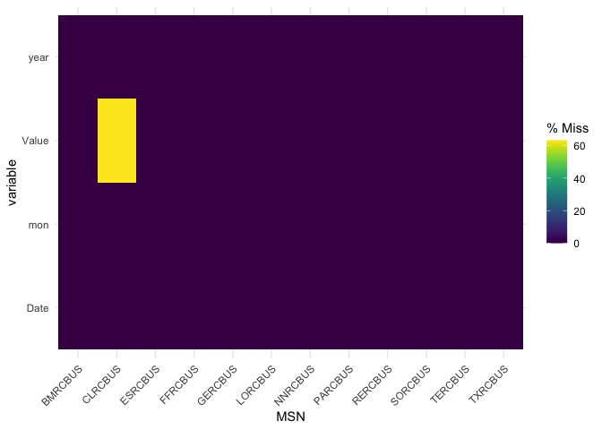<!-- -->

``` r
ec %>% group_by(MSN) %>% summarise(
  non_na = sum(!is.na(Value)),na = sum(is.na(Value)))
```

    ## # A tibble: 12 × 3
    ##    MSN     non_na    na
    ##    <chr>    <int> <int>
    ##  1 BMRCBUS    262     0
    ##  2 CLRCBUS     96   166
    ##  3 ESRCBUS    262     0
    ##  4 FFRCBUS    262     0
    ##  5 GERCBUS    262     0
    ##  6 LORCBUS    262     0
    ##  7 NNRCBUS    262     0
    ##  8 PARCBUS    262     0
    ##  9 RERCBUS    262     0
    ## 10 SORCBUS    262     0
    ## 11 TERCBUS    262     0
    ## 12 TXRCBUS    262     0

``` r
#Delete NAs and get final data frame
f.data <- na.omit(ec) 
```

## Visualisations

### Residential Sector Energy Consumption per source

Let’s start by visualizing the energy consumption for each energy
source.
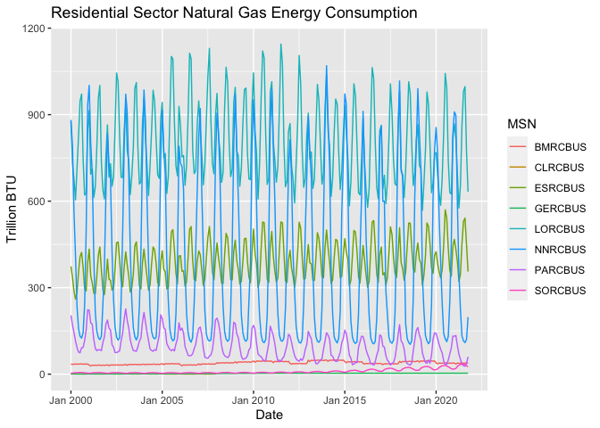
It’s difficult to detect any distinct trends from the above graph. We
observe natural gas is the most used energy source with significant
variations between the winter and summer seasons. Additionally, we can
observe that although there has been a little increasing tendency in
electricity sales over time, volatility has remained constant. We’re
going to visualize individually the consumption for fossil fuels and
renewable energy.

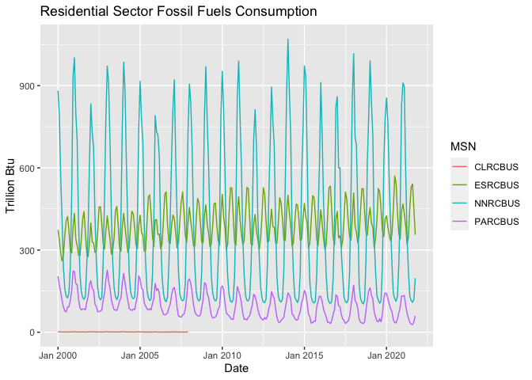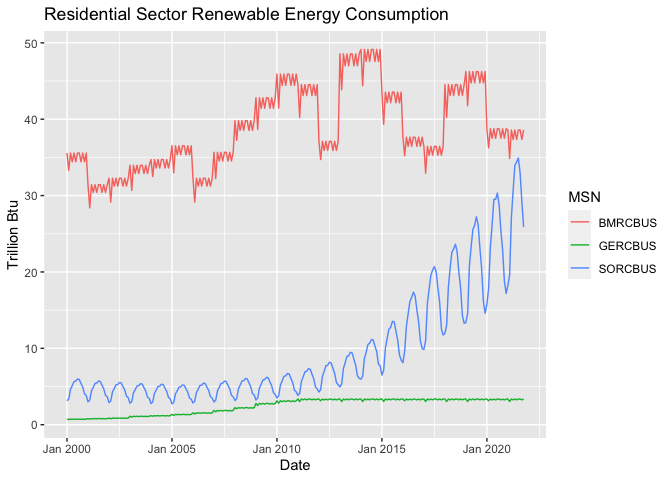

## Individual sources: Pie charts and Line graphs

Next to better see the amount of energy used by each source, we will
create a pie chart. The tables created in the data cleaning phase can be
used to interpret the abbreviations.

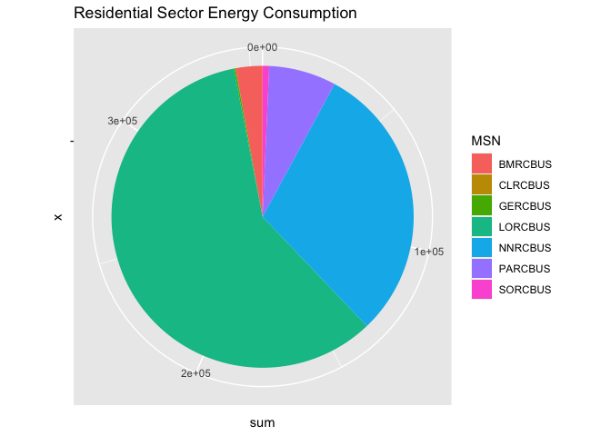<!-- -->

Finally, we’re going to visualise the mean energy consumed per
individual energy source.

    ## `summarise()` has grouped output by 'year'. You can override using the `.groups` argument.

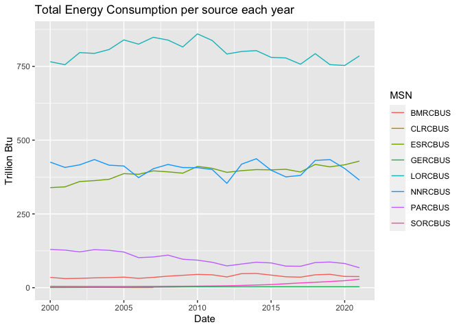<!-- -->

## Summary statistics and box plots per individual source

    ##       Date         BMRCBUS         CLRCBUS          ESRCBUS     
    ##  Min.   :2000   Min.   :28.38   Min.   :0.3820   Min.   :260.1  
    ##  1st Qu.:2002   1st Qu.:32.26   1st Qu.:0.6240   1st Qu.:315.7  
    ##  Median :2004   Median :33.61   Median :0.7730   Median :361.1  
    ##  Mean   :2004   Mean   :33.44   Mean   :0.8529   Mean   :367.1  
    ##  3rd Qu.:2006   3rd Qu.:35.34   3rd Qu.:1.0283   3rd Qu.:410.3  
    ##  Max.   :2008   Max.   :36.52   Max.   :1.7910   Max.   :512.1  
    ##     GERCBUS         LORCBUS          NNRCBUS          PARCBUS      
    ##  Min.   :0.681   Min.   : 604.5   Min.   : 111.1   Min.   : 54.93  
    ##  1st Qu.:0.803   1st Qu.: 691.3   1st Qu.: 142.9   1st Qu.: 82.13  
    ##  Median :1.107   Median : 769.5   Median : 312.4   Median :107.41  
    ##  Mean   :1.161   Mean   : 804.0   Mean   : 410.9   Mean   :120.08  
    ##  3rd Qu.:1.363   3rd Qu.: 892.7   3rd Qu.: 692.9   3rd Qu.:156.50  
    ##  Max.   :1.868   Max.   :1129.9   Max.   :1001.5   Max.   :226.45  
    ##     SORCBUS     
    ##  Min.   :2.718  
    ##  1st Qu.:3.648  
    ##  Median :4.649  
    ##  Mean   :4.446  
    ##  3rd Qu.:5.190  
    ##  Max.   :5.984

    ## Warning in var(if (is.vector(x) || is.factor(x)) x else as.double(x), na.rm =
    ## na.rm): NAs introduced by coercion

    ##        Date     BMRCBUS     CLRCBUS     ESRCBUS     GERCBUS     LORCBUS 
    ##          NA   1.9651206   0.3333607  61.7581942   0.3657290 136.0019233 
    ##     NNRCBUS     PARCBUS     SORCBUS 
    ## 286.4640758  45.3295816   0.9139452

    ## # A tibble: 1,930 × 3
    ## # Groups:   MSN [8]
    ##    MSN     Value Date     
    ##    <chr>   <dbl> <yearmon>
    ##  1 CLRCBUS 1.47  Jan 2000 
    ##  2 CLRCBUS 1.09  Feb 2000 
    ##  3 CLRCBUS 0.848 Mar 2000 
    ##  4 CLRCBUS 0.967 Apr 2000 
    ##  5 CLRCBUS 0.648 May 2000 
    ##  6 CLRCBUS 0.656 Jun 2000 
    ##  7 CLRCBUS 0.792 Jul 2000 
    ##  8 CLRCBUS 0.81  Aug 2000 
    ##  9 CLRCBUS 0.67  Sep 2000 
    ## 10 CLRCBUS 0.531 Oct 2000 
    ## # … with 1,920 more rows

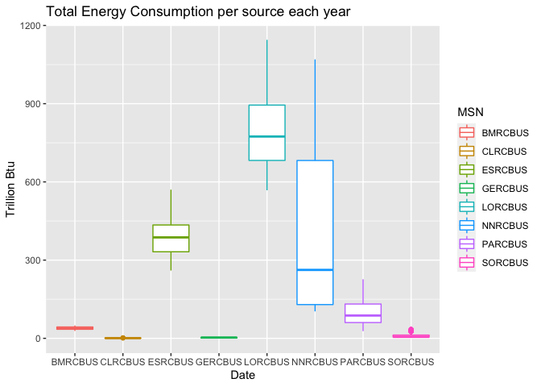<!-- -->

## Total Energy consumption

We are going to calculate the summary data for the total consumption and
sales.The graphs below show the total energy consumed, the energy
consumed in the recent years and the proportion of each one.

    ##     FFRCBUS          RERCBUS         TERCBUS        TXRCBUS      
    ##  Min.   : 134.5   Min.   :32.33   Min.   :1271   Min.   : 192.3  
    ##  1st Qu.: 202.5   1st Qu.:40.47   1st Qu.:1434   1st Qu.: 247.6  
    ##  Median : 354.4   Median :49.62   Median :1634   Median : 403.6  
    ##  Mean   : 503.3   Mean   :50.58   Mean   :1743   Mean   : 553.9  
    ##  3rd Qu.: 813.7   3rd Qu.:58.68   3rd Qu.:1972   3rd Qu.: 863.6  
    ##  Max.   :1224.4   Max.   :76.88   Max.   :2808   Max.   :1272.0

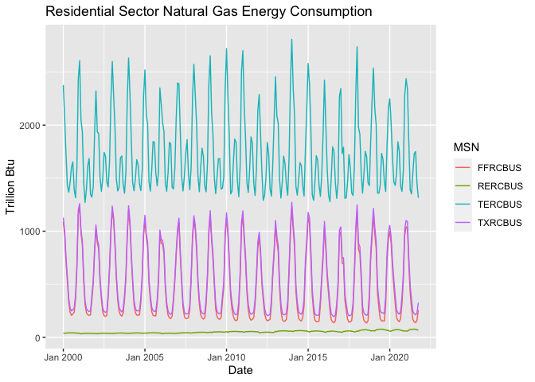<!-- -->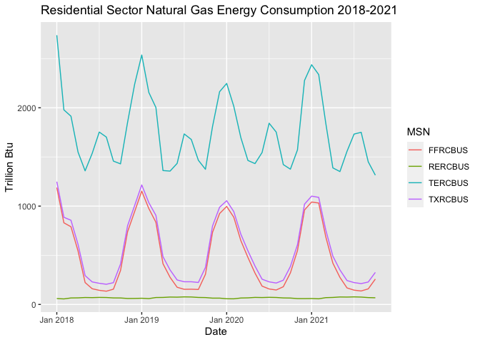<!-- -->

## Univariate data

For the univariate explaratory data analysis we choose to study the
natural gas consumption. We create a time series with the values that we
subseted from the dataset starting from 2000 with monthly frequency.
<table>
<thead>
<tr>
<th style="text-align:center;">
MSN
</th>
<th style="text-align:center;">
year
</th>
<th style="text-align:center;">
mon
</th>
<th style="text-align:center;">
Value
</th>
<th style="text-align:center;">
Date
</th>
</tr>
</thead>
<tbody>
<tr>
<td style="text-align:center;">
NNRCBUS
</td>
<td style="text-align:center;">
2000
</td>
<td style="text-align:center;">
1
</td>
<td style="text-align:center;">
881.954
</td>
<td style="text-align:center;">
Jan 2000
</td>
</tr>
<tr>
<td style="text-align:center;">
NNRCBUS
</td>
<td style="text-align:center;">
2000
</td>
<td style="text-align:center;">
2
</td>
<td style="text-align:center;">
792.410
</td>
<td style="text-align:center;">
Feb 2000
</td>
</tr>
<tr>
<td style="text-align:center;">
NNRCBUS
</td>
<td style="text-align:center;">
2000
</td>
<td style="text-align:center;">
3
</td>
<td style="text-align:center;">
562.305
</td>
<td style="text-align:center;">
Mar 2000
</td>
</tr>
<tr>
<td style="text-align:center;">
NNRCBUS
</td>
<td style="text-align:center;">
2000
</td>
<td style="text-align:center;">
4
</td>
<td style="text-align:center;">
409.652
</td>
<td style="text-align:center;">
Apr 2000
</td>
</tr>
<tr>
<td style="text-align:center;">
NNRCBUS
</td>
<td style="text-align:center;">
2000
</td>
<td style="text-align:center;">
5
</td>
<td style="text-align:center;">
233.428
</td>
<td style="text-align:center;">
May 2000
</td>
</tr>
</tbody>
</table>

## Visualisation

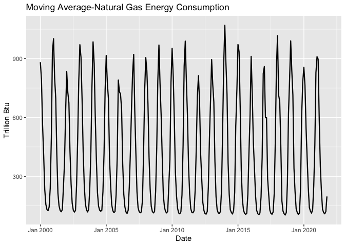<!-- -->
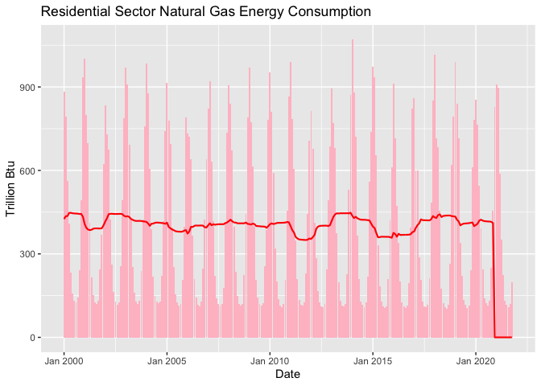<!-- -->

## Time series Analysis of Natural Gas consumption

### Autocorrelation and Partial Correlation

In the figure below, it can be observed that the ACF is sinusoidal,
which implies that the ACF is periodic. The peak recurs every 12 implies
that the ACF has a period of 12 lags which when calculated is equivalent
to a year.

The ACF is not approaching zero and thus it is most probably not
stationary.It can also be observed that the majority of the ACF values
are not within the bounds of statistical significance.

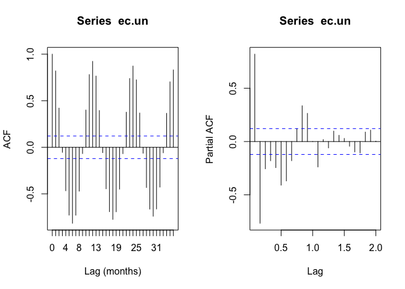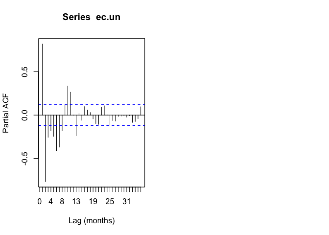

## Linear Trend

On the figure below, we observe that there is a slight upward trend.

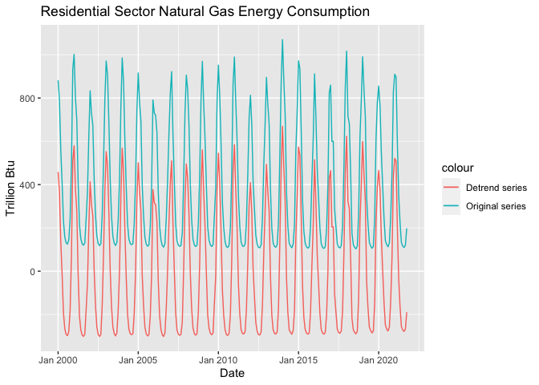<!-- -->

### Seosonality

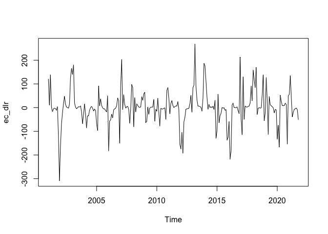<!-- -->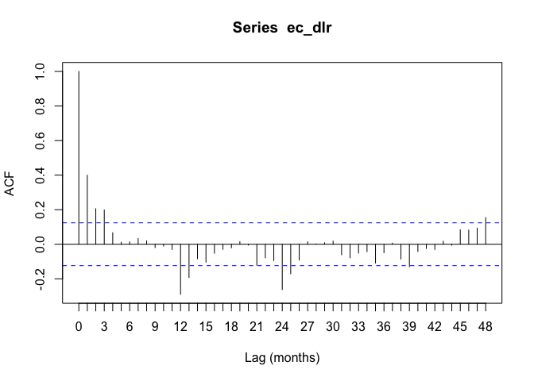<!-- -->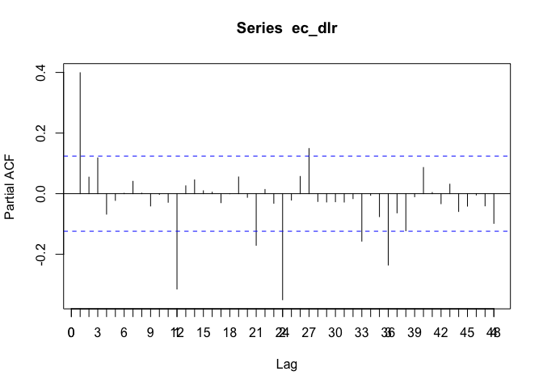<!-- -->

### Time series after removing linear trend and seasonality

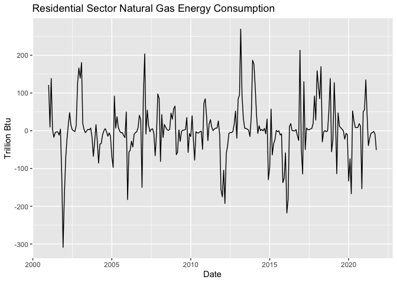<!-- -->

## Multivariate Data

For the multivariate analysis we’re choosing to study the total fossil
and renewable energy consumption.For this purpose we create a new
dataframe containing the variables of interest and then we reshape it in
order to make our analysis easier.

We can see from the below graphic that there is a significant disparity
between the usage of fossil fuels and renewable energy sources. We will
examine each one in more detail in the sections that follow.

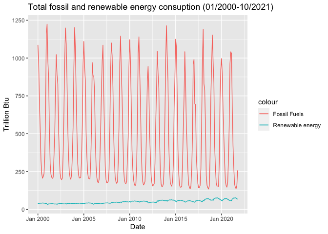<!-- -->

### ACF and PACF

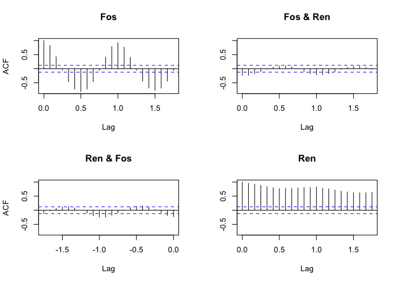<!-- -->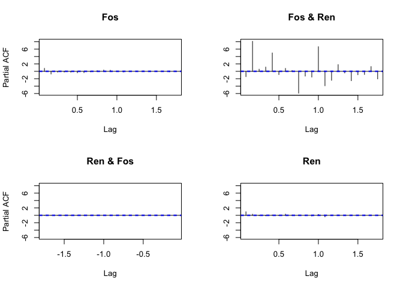<!-- -->
